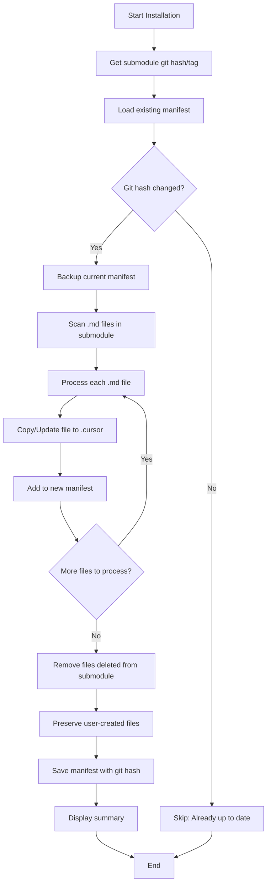

# Installation Script Specification

## Overview

This document specifies the behavior and implementation of the installation
scripts (`scripts/cursor-install.mjs` and `scripts/cursor-uninstall.mjs`) that
manage Cursor settings from the everything-claude-code submodule.

### Scope

This specification focuses on the **internal behavior** of the installation
scripts. For information about:

- **Build process and npm distribution**: See [BUILD_SPEC.md](./BUILD_SPEC.md)
- **Usage and API reference**: See [README.md](../README.md)

### How to Run Installation Scripts

The installation scripts can be invoked through multiple methods:

1. **CLI Command** (after npm install):
   ```bash
   everything-cursor install
   everything-cursor uninstall
   ```

2. **Programmatic API**:
   ```typescript
   import { install, uninstall } from "everything-cursor";
   await install({ location: "local" });
   ```

3. **Direct Script Execution** (from repository):
   ```bash
   node scripts/cursor-install.mjs
   node scripts/cursor-uninstall.mjs
   ```

4. **npm Scripts** (for development):
   ```bash
   npm run dev:install
   npm run dev:uninstall
   ```

All methods ultimately execute the same installation scripts described in this
specification.

## Problem Statement

Current implementation (`cursor-install.mjs`) completely removes existing
directories before copying from submodule:

```javascript
// Remove existing directory if it exists
if (fs.existsSync(destPath)) {
  await $`rm -rf ${destPath}`;
}
```

**Issue**: This deletes user-defined custom files in `.cursor/agents/`,
`.cursor/skills/`, etc.

## Requirements

### Must Have

1. **Preserve User Files**: Do not delete files that are not in the submodule
2. **Update Submodule Files**: Overwrite files that exist in the submodule with
   latest version
3. **Clean Installation**: Remove files that were previously in submodule but
   have been deleted
4. **Idempotent**: Running multiple times should produce consistent results

### Should Have

1. **Backup Option**: Optionally create backup before installation
2. **Dry Run Mode**: Show what would be changed without actually changing
3. **Verbose Output**: Show which files were updated/added/preserved

## Solution Overview

### Architecture Diagram

The following diagram illustrates the complete installation flow with git hash
tracking and file preservation:



**Key Points:**

- **Git Hash Tracking**: Installation only proceeds if submodule hash has
  changed
- **Markdown Only**: Only `.md` files are processed from the submodule
- **User File Preservation**: Files not in manifest are preserved (user-created)
- **Rollback Support**: Manifest backup enables rollback on failure

## File Filtering Strategy

### Scope Limitation

To improve security and reduce processing overhead, the installation script
**only processes `.md` (Markdown) files** from the submodule.

**Rationale:**

- The everything-claude-code submodule primarily contains documentation files
  (`.md`)
- Limiting file types reduces security risks (no executable files)
- Faster processing and clearer intent
- Simpler to maintain and test

**Implementation:**

```javascript
// Filter for .md files only
function getMdFiles(dir) {
  const files = [];
  const entries = fs.readdirSync(dir, { withFileTypes: true });

  for (const entry of entries) {
    const fullPath = path.join(dir, entry.name);

    if (entry.isDirectory()) {
      // Recursively scan subdirectories
      files.push(...getMdFiles(fullPath));
    } else if (
      entry.isFile() && path.extname(entry.name).toLowerCase() === ".md"
    ) {
      files.push(fullPath);
    }
  }

  return files;
}
```

**Impact:**

- Only `.md` files are copied to `.cursor/`
- Only `.md` files are tracked in the manifest
- Non-`.md` user files are unaffected

## Git Hash Tracking

### Update Detection Strategy

The installation script tracks the git commit hash of the submodule to determine
if an update is needed. This prevents unnecessary file operations when the
submodule hasn't changed.

**Priority Order:**

1. **Git Tag** (if available): `v1.2.3`
2. **Git Commit Hash**: Full SHA-1 hash

### Manifest Format Extension

```json
{
  "version": "1.0.0",
  "installedAt": "2026-01-31T12:00:00.000Z",
  "submoduleGitHash": "abc123def456...",
  "submoduleGitTag": "v1.2.3",
  "files": {
    "agents/planner.md": {
      "source": "everything-claude-code/agents/planner.md",
      "installedAt": "2026-01-31T12:00:00.000Z",
      "checksum": "sha256-hash-here"
    }
  }
}
```

### Update Check Logic

```javascript
// Get current git information from submodule
const currentHash = (await $`git -C ${SUBMODULE_PATH} rev-parse HEAD`).stdout
  .trim();
const currentTag =
  (await $`git -C ${SUBMODULE_PATH} describe --tags --exact-match 2>/dev/null || echo ""`)
    .stdout.trim();

// Load previous manifest
const manifest = loadManifest();

// Check if update is needed
if (manifest && manifest.submoduleGitHash === currentHash) {
  console.log(chalk.blue("✓ Already up to date"));
  console.log(
    `  Submodule version: ${
      manifest.submoduleGitTag || currentHash.slice(0, 7)
    }`,
  );
  process.exit(0);
}

// Display update information
const oldVersion = manifest?.submoduleGitTag ||
  manifest?.submoduleGitHash?.slice(0, 7) || "initial";
const newVersion = currentTag || currentHash.slice(0, 7);
console.log(chalk.cyan(`🔄 Updating: ${oldVersion} → ${newVersion}`));
```

**Benefits:**

- Skips installation when submodule is unchanged
- Provides clear version information to users
- Enables rollback to specific versions
- Tag support improves human readability

## Proposed Behavior

### File Operations by Scenario

**Note**: Only `.md` files are processed. All other file types are ignored.

| Scenario                              | File Location                          | Action                                      |
| ------------------------------------- | -------------------------------------- | ------------------------------------------- |
| `.md` file exists in submodule only   | `everything-claude-code/agents/foo.md` | Copy to `.cursor/agents/foo.md`             |
| `.md` file exists in both locations   | Both locations                         | Overwrite `.cursor/` with submodule version |
| `.md` file exists in `.cursor/` only  | `.cursor/agents/custom.md`             | **Preserve** (do not delete)                |
| `.md` file was removed from submodule | Previously tracked, now gone           | Remove from `.cursor/`                      |
| Non-`.md` file in `.cursor/`          | `.cursor/agents/script.sh`             | **Preserve** (ignored by script)            |

### Tracking Installed Files

To determine which files were installed by the script (vs user-created),
maintain a manifest file:

**Location**: `.cursor/.everything-cursor-manifest.json`

**Format**:

```json
{
  "version": "1.0.0",
  "installedAt": "2026-01-31T01:32:00.000Z",
  "submoduleGitHash": "abc123def456789...",
  "submoduleGitTag": "v1.2.3",
  "files": {
    "agents/planner.md": {
      "source": "everything-claude-code/agents/planner.md",
      "installedAt": "2026-01-31T01:32:00.000Z",
      "checksum": "sha256-hash-here"
    },
    "skills/tdd-workflow/SKILL.md": {
      "source": "everything-claude-code/skills/tdd-workflow/SKILL.md",
      "installedAt": "2026-01-31T01:32:00.000Z",
      "checksum": "sha256-hash-here"
    }
  }
}
```

**New Fields:**

- `submoduleGitHash`: Git commit hash of the submodule at installation time
- `submoduleGitTag`: Git tag (if available) for human-readable versioning
- Only `.md` files are tracked in the `files` object

## Implementation Algorithm

### Installation Flow

```
1. Get current git hash and tag from submodule
2. Load previous manifest (if exists)
3. Compare git hashes:
   - If hash unchanged: Skip installation (already up to date)
   - If hash changed: Proceed with installation
4. Backup current manifest for rollback
5. For each directory (agents, skills, commands, rules):
   a. Scan submodule directory for .md files only
   b. For each .md file in submodule:
      - Copy file to .cursor/
      - Add/update entry in manifest
   c. For each file in previous manifest but NOT in submodule:
      - Remove file from .cursor/ (was deleted from submodule)
      - Remove entry from manifest
   d. User-created files (in .cursor/ but not in manifest):
      - Leave untouched (preserved)
6. Save new manifest with git hash/tag
7. Display summary of changes
```

### Pseudo Code

```javascript
// Get current git information from submodule
const currentHash = (await $`git -C ${SUBMODULE_PATH} rev-parse HEAD`).stdout
  .trim();
const currentTag =
  (await $`git -C ${SUBMODULE_PATH} describe --tags --exact-match 2>/dev/null || echo ""`)
    .stdout.trim();

// Load or create manifest
let manifest = loadManifest() || { version: "1.0.0", files: {} };

// Check if update is needed
if (manifest.submoduleGitHash === currentHash) {
  console.log("Already up to date");
  process.exit(0);
}

// Backup manifest for rollback
backupManifest(manifest);

// Create new manifest with git info
let newManifest = {
  version: "1.0.0",
  installedAt: new Date().toISOString(),
  submoduleGitHash: currentHash,
  submoduleGitTag: currentTag || undefined,
  files: {},
};

for (const dir of DIRS_TO_COPY) {
  const sourceDir = path.join(SUBMODULE_PATH, dir);
  const destDir = path.join(CURSOR_DIR, dir);

  // Create destination directory if needed
  fs.mkdirSync(destDir, { recursive: true });

  // Get only .md files from submodule (recursively)
  const mdFiles = getMdFiles(sourceDir);

  // Copy/update .md files from submodule
  for (const file of mdFiles) {
    const relativePath = path.relative(sourceDir, file);
    const destPath = path.join(destDir, relativePath);
    const manifestKey = `${dir}/${relativePath}`;

    // Copy file
    fs.mkdirSync(path.dirname(destPath), { recursive: true });
    fs.copyFileSync(file, destPath);

    // Add to new manifest
    newManifest.files[manifestKey] = {
      source: path.relative(REPO_ROOT, file),
      installedAt: new Date().toISOString(),
      checksum: calculateChecksum(file),
    };
  }

  // Remove files that were in old manifest but not in submodule anymore
  for (const [manifestKey, fileInfo] of Object.entries(manifest.files)) {
    if (manifestKey.startsWith(`${dir}/`) && !newManifest.files[manifestKey]) {
      const filePath = path.join(CURSOR_DIR, manifestKey);
      if (fs.existsSync(filePath)) {
        fs.unlinkSync(filePath);
        console.log(`Removed: ${manifestKey} (deleted from submodule)`);
      }
    }
  }
}

// Save manifest
saveManifest(newManifest);

// Helper: Get only .md files recursively
function getMdFiles(dir) {
  const files = [];
  for (const entry of fs.readdirSync(dir, { withFileTypes: true })) {
    const fullPath = path.join(dir, entry.name);
    if (entry.isDirectory()) {
      files.push(...getMdFiles(fullPath));
    } else if (
      entry.isFile() && path.extname(entry.name).toLowerCase() === ".md"
    ) {
      files.push(fullPath);
    }
  }
  return files;
}
```

## Error Handling

### Error Categories and Recovery

The installation script must handle various error scenarios gracefully with
appropriate recovery strategies.

#### 1. Git Operation Errors

**Scenario**: Failed to retrieve git hash or tag from submodule

```javascript
try {
  const gitHash = (await $`git -C ${SUBMODULE_PATH} rev-parse HEAD`).stdout
    .trim();
} catch (error) {
  console.error(chalk.red("✗ Failed to get git hash from submodule"));
  console.error(
    "  Is the submodule initialized? Try: git submodule update --init",
  );
  process.exit(1);
}
```

**Recovery**: Exit with clear error message and resolution steps

#### 2. Manifest Parse Errors

**Scenario**: Corrupted or invalid manifest JSON

```javascript
function loadManifest() {
  try {
    const manifestPath = path.join(CURSOR_DIR, MANIFEST_FILE);
    if (!fs.existsSync(manifestPath)) {
      return null;
    }
    const content = fs.readFileSync(manifestPath, "utf-8");
    const manifest = JSON.parse(content);

    // Validate manifest structure
    if (!manifest.version || typeof manifest.files !== "object") {
      throw new Error("Invalid manifest structure");
    }

    return manifest;
  } catch (error) {
    console.warn(chalk.yellow("⚠ Manifest file is corrupted or invalid"));
    console.warn("  Treating as fresh installation");
    return null;
  }
}
```

**Recovery**: Treat as fresh installation (no manifest exists)

#### 3. File System Errors

**Scenario**: Permission denied, disk full, or I/O errors

```javascript
try {
  fs.copyFileSync(srcPath, destPath);
} catch (error) {
  if (error.code === "EACCES") {
    console.error(chalk.red("✗ Permission denied"));
    console.error(`  Cannot write to: ${destPath}`);
    console.error("  Check file permissions");
  } else if (error.code === "ENOSPC") {
    console.error(chalk.red("✗ Insufficient disk space"));
    console.error("  Free up disk space and try again");
  } else {
    console.error(chalk.red(`✗ Failed to copy file: ${error.message}`));
  }

  // Rollback using backup manifest
  await rollbackInstallation();
  process.exit(1);
}
```

**Recovery**: Rollback to previous state using backup manifest

#### 4. Partial Installation Failure

**Scenario**: Some files copied successfully, then error occurs

**Strategy**: Use try-catch with rollback

```javascript
let installedFiles = [];

try {
  for (const file of mdFiles) {
    fs.copyFileSync(file, destPath);
    installedFiles.push(destPath);
    // ... update manifest entry
  }
} catch (error) {
  console.error(chalk.red("✗ Installation failed"));
  console.error("  Rolling back changes...");

  // Remove partially installed files
  for (const installedFile of installedFiles) {
    try {
      fs.unlinkSync(installedFile);
    } catch (e) {
      console.warn(`  Warning: Could not remove ${installedFile}`);
    }
  }

  // Restore backup manifest
  restoreManifest();

  throw error;
}
```

**Recovery**: Remove partially installed files, restore backup manifest

#### 5. Manifest Write Failure

**Scenario**: Cannot save new manifest after successful installation

```javascript
try {
  saveManifest(newManifest);
} catch (error) {
  console.error(chalk.red("✗ Failed to save manifest"));
  console.error("  Installation completed but tracking may be inconsistent");
  console.error("  Consider running installation again");
  process.exit(1);
}
```

**Recovery**: Warn user, suggest re-running installation

### Rollback Mechanism

See [Rollback Mechanism](#rollback-mechanism) section for detailed rollback
specifications.

## User Experience Specification

### Output Format and Color Coding

The installation script provides clear, color-coded feedback to users throughout
the process.

**Dependencies**: Uses `chalk` (included in `zx` package, no additional
installation needed)

#### Status Indicators

- ✅ **Green**: Successful operations
- ✗ **Red**: Errors
- ⚠ **Yellow**: Warnings
- → **Blue**: Informational messages
- 🔄 **Cyan**: Progress/updates

#### Installation Output Example

```
📦 Installing everything-cursor...
🔄 Submodule: abc1234 → def5678 (v1.2.3)

Processing .md files:
  agents/
    ✓ planner.md (updated)
    ✓ architect.md (updated)
    ✓ tdd-guide.md (updated)
  skills/
    ✓ tdd-workflow/SKILL.md (updated)
    ✓ security-review/SKILL.md (updated)
  User files:
    → agents/my-custom-agent.md (preserved)
    → skills/my-skill/SKILL.md (preserved)
  Cleanup:
    ✗ agents/deprecated.md (removed - deleted from submodule)

Summary:
━━━━━━━━━━━━━━━━━━━━━━━━━━━━━━━━━━━━
  15 .md files updated
  2 .md files added
  1 .md file removed
  3 user files preserved
━━━━━━━━━━━━━━━━━━━━━━━━━━━━━━━━━━━━
✅ Installation complete!
  Submodule version: v1.2.3 (def5678)
```

#### No Update Needed Output

```
📦 Checking everything-cursor...
✓ Already up to date
  Submodule version: v1.2.3 (def5678)
```

#### Error Output Example

```
📦 Installing everything-cursor...
✗ Failed to get git hash from submodule
  Is the submodule initialized?
  Try: git submodule update --init
```

### Progress Tracking

For each file operation, display:

1. **Directory context**: Group files by parent directory
2. **File name**: Relative path from directory
3. **Operation type**: updated/added/preserved/removed
4. **Clear visual hierarchy**: Indentation for nested items

### User File Detection

When a file exists in `.cursor/` but not in the manifest:

```javascript
if (!manifest.files[manifestKey] && fs.existsSync(destPath)) {
  console.log(chalk.blue(`  → ${manifestKey} (preserved - user file)`));
  userFilesPreserved++;
}
```

### Summary Statistics

Track and display:

- Files updated (overwrote existing)
- Files added (new from submodule)
- Files removed (deleted from submodule)
- User files preserved (not in manifest)

### Implementation

```javascript
import { chalk } from "zx";

// Track statistics
let stats = {
  updated: 0,
  added: 0,
  removed: 0,
  preserved: 0,
};

// Example usage
console.log(chalk.green("✓"), `${file} (updated)`);
stats.updated++;

// Display summary
console.log(chalk.green.bold("\n✅ Installation complete!"));
console.log(chalk.blue("Summary:"));
console.log("━".repeat(40));
console.log(chalk.cyan(`  ${stats.updated} .md files updated`));
console.log(chalk.cyan(`  ${stats.added} .md files added`));
console.log(chalk.cyan(`  ${stats.removed} .md files removed`));
console.log(chalk.cyan(`  ${stats.preserved} user files preserved`));
console.log("━".repeat(40));
```

## Edge Cases

### 1. User Modified Submodule File

If user modifies a `.md` file that exists in submodule (e.g., customizes
`agents/planner.md`):

- **Current Behavior**: File will be overwritten
- **Recommendation**: Show warning if checksum differs from last installation
- **Rationale**: User modifications to submodule files will be lost on update
- **Future Enhancement**: Offer merge/diff options or backup user modifications

**Example Warning**:

```
⚠ agents/planner.md has been modified locally
  This file will be overwritten with the submodule version
  Consider backing up your changes if needed
```

### 2. Manifest File Missing

If `.cursor/.everything-cursor-manifest.json` is deleted:

- Cannot distinguish user files from installed files
- Cannot determine previous git hash (will reinstall)
- **Solution**: Treat all existing `.md` files as user files (preserve
  everything)
- Only add new files from submodule
- Create fresh manifest with current git hash

**Impact**:

- No files will be removed (safe)
- All files updated to match submodule
- User files preserved

### 3. Git Hash Unchanged but Files Modified

If submodule git hash hasn't changed but files were manually modified:

- **Current Behavior**: Installation skipped (hash match)
- **Workaround**: Use `--force` flag (future enhancement)
- **Detection**: Compare checksums even when hash matches (future enhancement)

### 4. Directory Rename in Submodule

If a directory is renamed in submodule (e.g., `agents/` → `agent/`):

- Old directory will remain with user files
- New directory will be created with submodule files
- Old submodule files removed (tracked in manifest)
- **Consider**: Add migration guide in release notes

### 5. Non-.md Files in .cursor/

User creates non-`.md` files in `.cursor/` directories:

- **Behavior**: Completely ignored by script
- **Rationale**: Script only processes `.md` files
- **Safety**: User files are safe regardless of extension

**Example**:

```
.cursor/
  agents/
    planner.md          # Managed by script
    my-script.sh        # Ignored by script, preserved
    custom-agent.md     # Preserved if not in manifest
```

### 6. Submodule Not at Expected Commit

User manually checks out different commit in submodule:

- **Behavior**: Script uses whatever is currently checked out
- **Git hash tracking**: Manifest records the actual hash
- **Safety**: No issues, works as expected

**Note**: Users control submodule version via git commands:

```bash
cd everything-claude-code
git checkout v1.2.3  # or specific commit
cd ..
pnpm cursor-install  # Uses checked-out version
```

## Testing Scenarios

**Note**: The following test scenarios use specific command examples (e.g.,
`pnpm cursor-install`), but the same tests apply to all invocation methods:

- CLI command: `everything-cursor install`
- Programmatic API: `await install({ location: "local" })`
- Direct script: `node scripts/cursor-install.mjs`
- npm script: `npm run dev:install`

### Test Case 1: Fresh Installation

- **Given**: No `.cursor/` directory exists
- **When**: Run installation script
- **Then**:
  - All `.md` files from submodule copied to `.cursor/`
  - Manifest created with current git hash
  - Summary displayed showing files added

**Expected Output**:

```
📦 Installing everything-cursor...
Processing .md files:
  agents/
    ✓ planner.md (added)
    ✓ architect.md (added)
  ...
Summary:
  25 .md files added
✅ Installation complete!
  Submodule version: v1.2.3 (abc1234)
```

### Test Case 2: Re-installation (Git Hash Unchanged)

- **Given**: Installation previously completed
- **And**: Submodule git hash has not changed
- **When**: Run `pnpm cursor-install`
- **Then**:
  - Installation skipped (already up to date)
  - No file operations performed
  - Exit code 0

**Expected Output**:

```
📦 Checking everything-cursor...
✓ Already up to date
  Submodule version: v1.2.3 (abc1234)
```

### Test Case 3: Update Installation (Git Hash Changed)

- **Given**: Installation previously completed with hash `abc1234`
- **And**: Submodule updated to hash `def5678`
- **When**: Run `pnpm cursor-install`
- **Then**:
  - Manifest backed up
  - All `.md` files updated
  - Manifest updated with new hash
  - Summary shows updates

**Expected Output**:

```
📦 Installing everything-cursor...
🔄 Updating: v1.2.2 → v1.2.3
Processing .md files:
  agents/
    ✓ planner.md (updated)
    ✓ architect.md (updated)
Summary:
  23 .md files updated
  2 .md files added
✅ Installation complete!
```

### Test Case 4: User Added Custom .md File

- **Given**: User created `.cursor/agents/my-custom-agent.md`
- **And**: File is not tracked in manifest
- **When**: Run `pnpm cursor-install` (with git hash change)
- **Then**:
  - Custom file preserved (not in manifest)
  - Submodule files updated
  - Custom file not added to manifest

**Expected Output**:

```
Processing .md files:
  agents/
    ✓ planner.md (updated)
    → my-custom-agent.md (preserved - user file)
Summary:
  20 .md files updated
  1 user file preserved
```

### Test Case 5: User Added Non-.md File

- **Given**: User created `.cursor/agents/helper.sh`
- **When**: Run `pnpm cursor-install`
- **Then**:
  - Non-`.md` file completely ignored
  - No mention in output (not processed)
  - File remains untouched

### Test Case 6: File Removed from Submodule

- **Given**: Previous installation had `agents/deprecated.md` (in manifest)
- **And**: File no longer exists in submodule
- **And**: Git hash changed
- **When**: Run `pnpm cursor-install`
- **Then**:
  - `deprecated.md` removed from `.cursor/agents/`
  - Entry removed from manifest

**Expected Output**:

```
Cleanup:
  ✗ agents/deprecated.md (removed - deleted from submodule)
Summary:
  20 .md files updated
  1 .md file removed
```

### Test Case 7: Missing Manifest

- **Given**: `.cursor/.everything-cursor-manifest.json` was deleted
- **And**: `.cursor/agents/my-custom-agent.md` exists (user file)
- **And**: `.cursor/agents/planner.md` exists (submodule file)
- **When**: Run `pnpm cursor-install`
- **Then**:
  - All existing files treated as user files (preserved)
  - Submodule files updated (overwritten)
  - New manifest created with all submodule files
  - User file not tracked in manifest

### Test Case 8: Installation Failure with Rollback

- **Given**: Installation in progress
- **When**: File copy fails (e.g., disk full, permission error)
- **Then**:
  - Error displayed
  - Automatic rollback initiated
  - Partially installed files removed
  - Previous manifest restored
  - Exit with error code

**Expected Output**:

```
📦 Installing everything-cursor...
Processing .md files:
  agents/
    ✓ planner.md (updated)
    ✗ Failed to copy file: ENOSPC
⟳ Rolling back changes...
  ✓ Removed planner.md
✓ Rollback complete
```

### Test Case 9: Manual Rollback

- **Given**: Installation completed with issues
- **And**: Backup manifest exists
- **When**: Run `pnpm cursor-install --rollback`
- **Then**:
  - Previous version information displayed
  - Files from backup manifest restored
  - Files not in backup manifest removed
  - Backup manifest becomes current manifest

**Expected Output**:

```
⟳ Rolling back to previous installation...
  Current: v1.2.3
  Rollback to: v1.2.2
  ✓ Restored agents/planner.md
  ✓ Restored agents/architect.md
  ✗ Removed agents/new-feature.md
✅ Rollback complete!
  Version: v1.2.2
```

### Test Case 10: Submodule at Different Commit

- **Given**: User manually checks out older commit in submodule
- **When**: Run `pnpm cursor-install`
- **Then**:
  - Script uses files from checked-out commit
  - Manifest records actual commit hash
  - Installation proceeds normally

**Setup**:

```bash
cd everything-claude-code
git checkout v1.2.2
cd ..
pnpm cursor-install
```

## Rollback Mechanism

### Overview

The rollback mechanism ensures that installation failures don't leave the system
in an inconsistent state. Users can also manually rollback to a previous
installation.

### Backup Strategy

**Manifest Backup Location**: `.cursor/.everything-cursor-manifest.backup.json`

**When Backups Occur**:

1. Before every installation (automatic)
2. Before manual rollback (preserve current state)

```javascript
function backupManifest(manifest) {
  const backupPath = path.join(CURSOR_DIR, MANIFEST_BACKUP_FILE);

  if (!manifest) {
    console.log(chalk.blue("ℹ No previous manifest to backup"));
    return;
  }

  try {
    fs.writeFileSync(backupPath, JSON.stringify(manifest, null, 2));
    console.log(chalk.blue("✓ Manifest backed up"));
  } catch (error) {
    console.warn(chalk.yellow("⚠ Failed to backup manifest"));
    console.warn("  Proceeding without backup...");
  }
}
```

### Automatic Rollback on Failure

When installation fails (file copy error, disk full, etc.), automatically
restore previous state:

```javascript
async function installWithRollback() {
  const manifest = loadManifest();
  backupManifest(manifest);

  const installedFiles = [];

  try {
    // Installation process
    for (const file of mdFiles) {
      const destPath = path.join(destDir, relativePath);
      fs.copyFileSync(srcPath, destPath);
      installedFiles.push({ path: destPath, isNew: !fs.existsSync(destPath) });
    }

    // Save new manifest
    saveManifest(newManifest);

    // Success - remove backup
    removeBackup();
  } catch (error) {
    console.error(chalk.red("✗ Installation failed"));
    console.error(`  ${error.message}`);
    console.log(chalk.yellow("\n⟳ Rolling back changes..."));

    // Rollback: Remove newly installed files
    for (const file of installedFiles) {
      try {
        if (file.isNew) {
          fs.unlinkSync(file.path);
          console.log(chalk.yellow(`  ✓ Removed ${file.path}`));
        }
      } catch (e) {
        console.warn(chalk.yellow(`  ⚠ Could not remove ${file.path}`));
      }
    }

    // Restore previous manifest
    restoreManifest();

    console.log(chalk.yellow("✓ Rollback complete"));
    process.exit(1);
  }
}
```

### Manual Rollback

Allow users to manually rollback to previous installation:

```bash
pnpm cursor-install --rollback
```

**Implementation**:

```javascript
async function performRollback() {
  console.log(chalk.cyan("⟳ Rolling back to previous installation..."));

  // Load backup manifest
  const backupPath = path.join(CURSOR_DIR, MANIFEST_BACKUP_FILE);
  if (!fs.existsSync(backupPath)) {
    console.error(chalk.red("✗ No backup found"));
    console.error("  Cannot rollback without backup manifest");
    process.exit(1);
  }

  const backupManifest = JSON.parse(fs.readFileSync(backupPath, "utf-8"));
  const currentManifest = loadManifest();

  // Display version information
  const currentVersion = currentManifest?.submoduleGitTag ||
    currentManifest?.submoduleGitHash?.slice(0, 7);
  const backupVersion = backupManifest.submoduleGitTag ||
    backupManifest.submoduleGitHash?.slice(0, 7);

  console.log(chalk.blue(`  Current: ${currentVersion}`));
  console.log(chalk.blue(`  Rollback to: ${backupVersion}`));

  // Remove files not in backup
  if (currentManifest) {
    for (const [key, _] of Object.entries(currentManifest.files)) {
      if (!backupManifest.files[key]) {
        const filePath = path.join(CURSOR_DIR, key);
        if (fs.existsSync(filePath)) {
          fs.unlinkSync(filePath);
          console.log(chalk.yellow(`  ✗ Removed ${key}`));
        }
      }
    }
  }

  // Restore files from backup manifest
  for (const [key, fileInfo] of Object.entries(backupManifest.files)) {
    const srcPath = path.join(REPO_ROOT, fileInfo.source);
    const destPath = path.join(CURSOR_DIR, key);

    if (fs.existsSync(srcPath)) {
      fs.mkdirSync(path.dirname(destPath), { recursive: true });
      fs.copyFileSync(srcPath, destPath);
      console.log(chalk.green(`  ✓ Restored ${key}`));
    } else {
      console.warn(chalk.yellow(`  ⚠ Source file missing: ${key}`));
    }
  }

  // Restore backup manifest as current
  restoreManifest();

  console.log(chalk.green("\n✅ Rollback complete!"));
  console.log(chalk.blue(`  Version: ${backupVersion}`));
}

function restoreManifest() {
  const backupPath = path.join(CURSOR_DIR, MANIFEST_BACKUP_FILE);
  const manifestPath = path.join(CURSOR_DIR, MANIFEST_FILE);

  if (fs.existsSync(backupPath)) {
    fs.copyFileSync(backupPath, manifestPath);
    console.log(chalk.green("  ✓ Manifest restored"));
  }
}
```

### Rollback Limitations

**Cannot Rollback:**

- If backup manifest is missing or corrupted
- If source files in submodule have been deleted (will skip with warning)
- User-created files (not tracked in manifest) are preserved

**Partial Rollback:**

- If some source files are missing, rollback continues for available files
- Warnings displayed for missing files
- System remains in usable state

### Rollback Testing

See [Testing Scenarios](#testing-scenarios) for rollback test cases.

## Command Line Options

### Implemented Options

The installation scripts support the following options:

**Using CLI Command**:

```bash
# Default: install with preservation and git hash tracking
everything-cursor install

# Rollback to previous installation
everything-cursor install --rollback
```

**Using Programmatic API**:

```typescript
// Default installation
await install({ location: "local" });

// With options
await install({
  location: "home",
  silent: true,
  cwd: "/custom/path",
});
```

**Using Direct Script Execution**:

```bash
# Default: install with preservation and git hash tracking
node scripts/cursor-install.mjs

# Rollback to previous installation
node scripts/cursor-install.mjs --rollback
```

**Using npm Scripts** (for development):

```bash
npm run dev:install
npm run dev:uninstall
```

### Future Enhancement Options

These options are planned for future implementation:

```bash
# Force clean installation (remove everything first)
everything-cursor install --clean

# Dry run (show what would change)
everything-cursor install --dry-run

# Verbose output (detailed file-by-file progress)
everything-cursor install --verbose

# Force installation even if git hash unchanged
everything-cursor install --force
```

Or via programmatic API:

```typescript
await install({
  location: "local",
  clean: true, // Force clean installation
  dryRun: true, // Dry run mode
  verbose: true, // Verbose output
  force: true, // Force even if unchanged
});
```

### Option Details

#### `--rollback`

Restores the previous installation using backup manifest.

**Behavior**:

- Loads `.everything-cursor-manifest.backup.json`
- Removes files added in current installation
- Restores files from previous installation
- Replaces current manifest with backup

**Usage**: After a problematic update

**Example** (using CLI command):

```bash
$ everything-cursor install
# ... installation completes but has issues ...
$ everything-cursor install --rollback
⟳ Rolling back to previous installation...
  Current: v1.2.3
  Rollback to: v1.2.2
  ✓ Restored agents/planner.md
  ✓ Restored agents/architect.md
  ...
✅ Rollback complete!
```

## Security Considerations

### Overview

Security is critical as the script modifies filesystem contents. Multiple layers
of protection prevent common attack vectors.

### 1. Path Traversal Prevention

**Risk**: Malicious file paths (e.g., `../../etc/passwd`) could write outside
`.cursor/` directory

**Implementation**:

```javascript
function validatePath(filePath, baseDir) {
  const resolved = path.resolve(baseDir, filePath);
  const normalized = path.normalize(resolved);

  // Ensure resolved path starts with base directory
  if (!normalized.startsWith(path.resolve(baseDir))) {
    throw new Error(`Path traversal detected: ${filePath}`);
  }

  return normalized;
}

// Usage in file copy
const destPath = validatePath(path.join(destDir, relativePath), CURSOR_DIR);
fs.copyFileSync(srcPath, destPath);
```

**Protection**: All destination paths validated before file operations

### 2. File Type Restriction

**Risk**: Malicious executable files or scripts in submodule

**Implementation**: Only process `.md` files

```javascript
function isMdFile(filePath) {
  const ext = path.extname(filePath).toLowerCase();
  return ext === ".md";
}

function getMdFiles(dir) {
  const files = [];
  for (const entry of fs.readdirSync(dir, { withFileTypes: true })) {
    const fullPath = path.join(dir, entry.name);

    if (entry.isDirectory()) {
      files.push(...getMdFiles(fullPath));
    } else if (entry.isFile() && isMdFile(fullPath)) {
      files.push(fullPath);
    }
    // Symlinks, other file types: ignored
  }
  return files;
}
```

**Protection**:

- No executable files (`.sh`, `.exe`, etc.)
- No script files (`.js`, `.py`, etc.)
- Only documentation files (`.md`)

### 3. Symlink Handling

**Risk**: Symlinks could point to sensitive files outside project

**Implementation**: Ignore symlinks entirely

```javascript
function getMdFiles(dir) {
  const files = [];
  for (const entry of fs.readdirSync(dir, { withFileTypes: true })) {
    // Skip symlinks
    if (entry.isSymbolicLink()) {
      console.warn(chalk.yellow(`⚠ Skipping symlink: ${entry.name}`));
      continue;
    }

    // Process only regular files and directories
    if (entry.isFile() && isMdFile(entry.name)) {
      files.push(path.join(dir, entry.name));
    } else if (entry.isDirectory()) {
      files.push(...getMdFiles(path.join(dir, entry.name)));
    }
  }
  return files;
}
```

**Protection**: Symlinks never followed or copied

### 4. Manifest Validation

**Risk**: Corrupted or tampered manifest could cause unexpected behavior

**Implementation**:

```javascript
function loadManifest() {
  try {
    const manifestPath = path.join(CURSOR_DIR, MANIFEST_FILE);
    if (!fs.existsSync(manifestPath)) {
      return null;
    }

    const content = fs.readFileSync(manifestPath, "utf-8");
    const manifest = JSON.parse(content);

    // Validate required fields
    if (!manifest.version || typeof manifest.files !== "object") {
      throw new Error("Invalid manifest structure");
    }

    // Validate git hash format (40 hex chars)
    if (
      manifest.submoduleGitHash &&
      !/^[a-f0-9]{40}$/i.test(manifest.submoduleGitHash)
    ) {
      throw new Error("Invalid git hash format");
    }

    // Validate file entries
    for (const [key, value] of Object.entries(manifest.files)) {
      if (!value.source || !value.installedAt) {
        throw new Error(`Invalid file entry: ${key}`);
      }

      // Ensure all tracked files are .md
      if (!key.endsWith(".md")) {
        console.warn(
          chalk.yellow(`⚠ Non-.md file in manifest: ${key} (will be ignored)`),
        );
      }
    }

    return manifest;
  } catch (error) {
    console.warn(chalk.yellow("⚠ Manifest validation failed"));
    console.warn(`  ${error.message}`);
    console.warn("  Treating as fresh installation");
    return null;
  }
}
```

**Protection**:

- JSON parse errors caught
- Required fields validated
- Git hash format validated
- Corrupted manifests treated as missing

### 5. Git Repository Validation

**Risk**: Submodule path could point to unexpected location

**Implementation**:

```javascript
function validateSubmodule() {
  // Ensure submodule path exists
  if (!fs.existsSync(SUBMODULE_PATH)) {
    throw new Error("Submodule directory not found");
  }

  // Ensure it's a git repository
  const gitDir = path.join(SUBMODULE_PATH, ".git");
  if (!fs.existsSync(gitDir)) {
    throw new Error("Submodule is not a git repository");
  }

  // Ensure path is within project
  const resolved = path.resolve(SUBMODULE_PATH);
  const repoRoot = path.resolve(REPO_ROOT);
  if (!resolved.startsWith(repoRoot)) {
    throw new Error("Submodule path outside repository");
  }
}
```

**Protection**: Submodule location and validity checked

### 6. Atomic Operations with Rollback

**Risk**: Partial installation leaves system in inconsistent state

**Protection**: See [Rollback Mechanism](#rollback-mechanism) section

### Security Checklist

Before installation:

- ✅ Validate submodule path and git repository
- ✅ Backup existing manifest
- ✅ Filter for `.md` files only

During installation:

- ✅ Validate all destination paths (no traversal)
- ✅ Ignore symlinks
- ✅ Track installed files in manifest

After installation:

- ✅ Validate and save new manifest
- ✅ Provide rollback option on failure

## Migration Path

For users upgrading from old script (destructive) to new script
(preservation-based):

### First Run After Upgrade

1. **No Manifest Exists**: Old script didn't create manifest
2. **All Existing Files Preserved**: Treated as user files (safe)
3. **Initial Manifest Created**: Based on current submodule state with git hash
4. **Git Hash Recorded**: Enables future update detection

**Migration Output**:

```
📦 Installing everything-cursor...
ℹ No previous manifest found (first run or upgrade)
  All existing files will be preserved

Processing .md files:
  agents/
    ✓ planner.md (updated)
    ✓ architect.md (updated)
    → custom-agent.md (preserved - user file)

Summary:
  20 .md files updated
  5 user files preserved
✅ Installation complete!
  Submodule version: v1.2.3 (abc1234)
```

### Behavior Changes

Users should be aware of these changes:

| Behavior         | Old Script            | New Script            |
| ---------------- | --------------------- | --------------------- |
| User files       | ❌ Deleted            | ✅ Preserved          |
| Update detection | ❌ None (always runs) | ✅ Git hash tracking  |
| File types       | All files             | Only `.md` files      |
| Rollback         | ❌ Not supported      | ✅ Supported          |
| Error recovery   | ❌ Manual cleanup     | ✅ Automatic rollback |

### Recommendation for Users

After upgrading to new script:

1. **Review existing files**: Check `.cursor/` for any files you want to keep
2. **First installation**: Will preserve all existing files (safe)
3. **Verify**: Check manifest was created
   (`.cursor/.everything-cursor-manifest.json`)
4. **Future updates**: Will use git hash tracking (only update when needed)

### Backward Compatibility

**No breaking changes**:

- Script works with or without existing manifest
- Preserves all existing files on first run
- Creates manifest for future runs

**Benefits**:

- Safe upgrade path
- No manual migration steps required
- User files never lost

## Success Metrics

The implementation is considered successful when all of the following criteria
are met:

### Functional Requirements

- ✅ **User files are never deleted**: Files not in manifest remain untouched
- ✅ **Submodule updates are applied correctly**: `.md` files updated when git
  hash changes
- ✅ **Deleted submodule files are cleaned up**: Files removed from submodule
  are removed from `.cursor/`
- ✅ **Installation is idempotent**: Multiple runs produce consistent results
- ✅ **Git hash tracking works**: Installation skipped when hash unchanged
- ✅ **Only .md files processed**: Non-markdown files ignored completely

### User Experience

- ✅ **Clear feedback on what changed**: Color-coded output with summary
  statistics
- ✅ **Version information displayed**: Git hash/tag shown in output
- ✅ **Progress visible**: File-by-file feedback during installation
- ✅ **Error messages are helpful**: Clear guidance on how to resolve issues

### Reliability

- ✅ **Rollback on failure**: Automatic recovery when installation fails
- ✅ **Manual rollback available**: Users can revert to previous version
- ✅ **Manifest backup created**: Every installation backs up previous manifest
- ✅ **Corrupted manifest handled**: Graceful degradation when manifest invalid

### Security

- ✅ **Path traversal prevented**: All paths validated before file operations
- ✅ **Symlinks ignored**: No symlink following or creation
- ✅ **File type restricted**: Only `.md` files processed
- ✅ **Git repository validated**: Submodule existence and validity checked

### Performance

- ✅ **Unnecessary updates avoided**: Git hash comparison skips redundant
  installations
- ✅ **Fast when up to date**: Minimal operations when no changes needed

### Validation Tests

All test cases in [Testing Scenarios](#testing-scenarios) must pass:

1. ✅ Fresh installation
2. ✅ Re-installation with unchanged hash (skip)
3. ✅ Update installation with changed hash
4. ✅ User custom `.md` file preservation
5. ✅ User non-`.md` file ignored
6. ✅ File removed from submodule cleanup
7. ✅ Missing manifest recovery
8. ✅ Installation failure rollback
9. ✅ Manual rollback
10. ✅ Submodule at different commit

## Home Directory Installation

### Overview

The installation script supports installing to either:

- **local**: Project-local directory (`{project}/.cursor/`)
- **home**: Home directory (`~/.cursor/`)

### Installation Location Selection

On **first run** (when no manifest exists), the user is prompted to select an
installation location:

```
📍 Select installation location:
  1) local  - Project local (.cursor/)
  2) home   - Home directory (~/.cursor/)
  3) cancel - Cancel installation

Enter your choice (1-3):
```

The selected location is saved in the manifest and used for all future
installations **without prompting**.

### Manifest Format Extension

The manifest includes two new fields to track the selected location:

```json
{
  "version": "1.0.0",
  "selectedLocation": "local",
  "installPath": "/Users/user/project/.cursor",
  "installedAt": "2026-01-31T12:00:00.000Z",
  "submoduleGitHash": "abc123...",
  "submoduleGitTag": "v1.2.3",
  "files": {
    "agents/planner.md": {
      "source": "everything-claude-code/agents/planner.md",
      "installedAt": "2026-01-31T12:00:00.000Z",
      "checksum": "sha256-hash"
    }
  }
}
```

**New fields:**

- `selectedLocation`: `"local"` or `"home"` - user's choice
- `installPath`: Absolute path to the installation directory

### Manifest Location

The manifest is stored in the same directory as the installed files:

- **local**: `{project}/.cursor/.everything-cursor-manifest.json`
- **home**: `~/.cursor/.everything-cursor-manifest.json`

### Location Priority

When loading an existing manifest, the script checks both locations with
priority:

1. **Local** (`{project}/.cursor/`)
2. **Home** (`~/.cursor/`)

The first manifest found is used.

### Changing Installation Location

To change the installation location:

1. Uninstall current installation:
   ```bash
   everything-cursor uninstall
   ```
2. Install again - the location prompt will appear:
   ```bash
   everything-cursor install
   ```
3. Select the desired new location

### Use Cases

**Local Installation** (project-specific):

- Project has unique configuration needs
- Different settings per project
- Settings tracked in project git repository (optional)

**Home Installation** (global):

- Share settings across all projects
- Consistent development environment
- Single source of truth for all coding

### Rollback Support

The rollback functionality works with both locations:

```bash
everything-cursor install --rollback
```

Or via programmatic API:

```typescript
await install({ rollback: true });
```

The script automatically:

1. Checks local directory for backup manifest
2. Falls back to home directory if not found
3. Restores files to the location specified in the backup manifest

### Example Output

**First Installation (prompt shown):**

```
📦 Installing everything-cursor...

📍 Select installation location:
  1) local  - Project local (.cursor/)
  2) home   - Home directory (~/.cursor/)
  3) cancel - Cancel installation

Enter your choice (1-3): 2

🔄 Updating: initial → v1.2.3
📍 Installing to: home (/Users/user/.cursor)

Processing .md files:
  agents/
    ✓ planner.md (added)
...
✅ Installation complete!
  Submodule version: v1.2.3 (def5678)
  Installed to: home
```

**Subsequent Installation (no prompt):**

```
📦 Installing everything-cursor...
Using saved location: home
✓ Already up to date
  Submodule version: v1.2.3 (def5678)
  Location: home
```

### Testing

Additional test cases for home directory installation:

1. **Home installation (first time)**
   - Prompt is displayed
   - `home` selected → files installed to `~/.cursor/`
   - Manifest saved with `selectedLocation: "home"`

2. **Subsequent installation (location remembered)**
   - No prompt displayed
   - Files installed to saved location
   - "Using saved location: X" message shown

3. **Location change**
   - Uninstall removes files and manifest
   - Reinstall shows prompt again
   - New location can be selected

4. **Manifest priority**
   - If both local and home manifests exist
   - Local takes priority
   - Warning message shown
